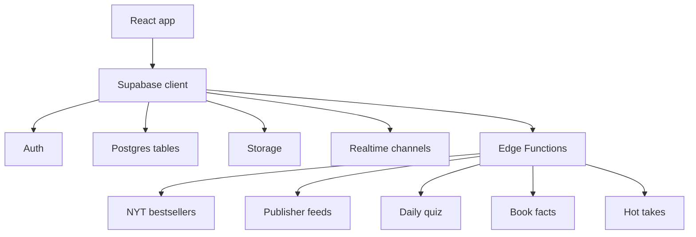

# BookCAT Supabase Guide

This document explains how Supabase is structured and how it powers BookCAT.

## 1) What Supabase does in this app

Supabase is the backend for:

- Authentication and user sessions
- User profiles and avatar storage
- Reading library data
- Reading session analytics
- Community chat and friendships
- Daily quizzes, book facts, hot takes, and trending books
- Realtime updates for community features
- Scheduled Edge Functions that keep content fresh

## 2) Main Supabase files in this workspace

- Supabase local config: [supabase/config.toml](supabase/config.toml)
- Database migrations: [supabase/migrations/](supabase/migrations)
- Edge Functions: [supabase/functions/](supabase/functions)
- Frontend client: [apps/web/src/lib/supabase.ts](apps/web/src/lib/supabase.ts)
- Auth flow: [apps/web/src/contexts/AuthContext.jsx](apps/web/src/contexts/AuthContext.jsx)

## 3) High-level architecture

## 4) Frontend connection

The frontend creates one shared Supabase client in [apps/web/src/lib/supabase.ts](apps/web/src/lib/supabase.ts) using:

- `VITE_SUPABASE_URL`
- `VITE_SUPABASE_ANON_KEY`

The auth provider in [apps/web/src/contexts/AuthContext.jsx](apps/web/src/contexts/AuthContext.jsx) does three main things:

1. Reads the active session
2. Listens for auth state changes
3. Loads the user profile from `profiles`

On sign-up, the app:

- Creates a Supabase Auth user
- Inserts a matching row into `profiles`

## 5) Database structure

### `profiles`
Defined in [supabase/migrations/001_auth_setup.sql](supabase/migrations/001_auth_setup.sql)

Stores user profile data.

Important columns:

- `id` — references `auth.users(id)`
- `username`
- `avatar_url`
- `bio`
- `email`
- `created_at`
- `updated_at`

Rules:

- Public read access for profiles
- Users can insert and update only their own profile
- `updated_at` is maintained by a trigger

### `books`
Defined in [supabase/migrations/002_books_table.sql](supabase/migrations/002_books_table.sql)

Stores each user’s personal library.

Important columns:

- `id`
- `user_id`
- `isbn`
- `title`
- `authors`
- `cover_url`
- `published_year`
- `description`
- `status`
- `progress`
- `source`
- `created_at`
- `updated_at`

Later migrations add:

- `total_pages`
- `current_page`
- `tags`

Rules:

- Users can only read their own books
- Users can only insert/update/delete their own books
- Unique ISBN per user is enforced when ISBN exists
- A trigger keeps `updated_at` fresh

### `reading_sessions`
Defined in [supabase/migrations/003_library_features.sql](supabase/migrations/003_library_features.sql)

Stores time spent reading.

Important columns:

- `id`
- `user_id`
- `book_id`
- `start_time`
- `end_time`
- `duration_seconds`
- `pages_read`
- `created_at`

Later migration [supabase/migrations/014_hot_takes_and_active_readers.sql](supabase/migrations/014_hot_takes_and_active_readers.sql) adds:

- `duration_minutes`
- `intent`

Rules:

- Users can only access their own sessions
- This table powers stats, streaks, and active-reader views

### `daily_quiz` and `user_quiz_answers`
Defined in [supabase/migrations/007_daily_quiz.sql](supabase/migrations/007_daily_quiz.sql)

`daily_quiz` stores one quiz per day.

Important fields:

- `quiz_date`
- `book_title`
- `book_author`
- `cover_url`
- `question_type`
- `question`
- `options`
- `correct_answer`
- `explanation`

`user_quiz_answers` stores each user’s answer.

Important fields:

- `user_id`
- `quiz_id`
- `selected_answer`
- `is_correct`
- `answered_at`

There is also a helper view:

- `today_quiz`

Rules:

- Quizzes are publicly readable
- Only the service role should manage quiz generation
- Users can save only their own answer row

### `daily_book_facts`
Defined in [supabase/migrations/009_book_facts.sql](supabase/migrations/009_book_facts.sql)

Stores AI-generated book facts.

Important fields:

- `fact_date`
- `fact_text`
- `book_title`
- `book_author`
- `category`
- `emoji`

Rules:

- Public read access
- Service role writes the facts

### `weekly_trending_books`
Defined in [supabase/migrations/010_weekly_trending.sql](supabase/migrations/010_weekly_trending.sql)

Stores NYT bestseller data.

Important fields:

- `title`
- `author`
- `isbn`
- `image_url`
- `amazon_url`
- `description`
- `rank`
- `list_name`
- `publisher`
- `week_start`

Rules:

- Public read access
- Service role writes the rows

### `daily_hot_takes` and `hot_take_votes`
Defined in [supabase/migrations/014_hot_takes_and_active_readers.sql](supabase/migrations/014_hot_takes_and_active_readers.sql)

`daily_hot_takes` stores one or more debate prompts per day.

Important fields:

- `take_date`
- `take_text`
- `topic`
- `category`
- `agree_count`
- `disagree_count`

`hot_take_votes` stores each user’s vote.

Important fields:

- `user_id`
- `hot_take_id`
- `vote`
- `created_at`

Rules:

- Hot takes are publicly readable
- Authenticated users can vote
- Users can only create or update their own vote row

### `friendships`
Defined in [supabase/migrations/016_community_tables.sql](supabase/migrations/016_community_tables.sql)

Stores friend requests and accepted friendships.

Important fields:

- `user_id`
- `friend_id`
- `status`
- `created_at`
- `updated_at`

Rules:

- Users can see relationships they are part of
- Users can send requests as `user_id`
- The receiving user can accept or reject
- Self-friending is blocked

### `messages`
Defined in [supabase/migrations/016_community_tables.sql](supabase/migrations/016_community_tables.sql) and reinforced by [supabase/migrations/017_ensure_messages_read_at.sql](supabase/migrations/017_ensure_messages_read_at.sql)

Stores direct messages between users.

Important fields:

- `sender_id`
- `receiver_id`
- `content`
- `read_at`
- `created_at`

Rules:

- Users can read messages they sent or received
- Users can send messages as `sender_id`
- Users can mark messages as read if they are the receiver
- Realtime is enabled for this table

## 6) Storage

The app uses Supabase Storage for avatars.

Created in [supabase/migrations/001_auth_setup.sql](supabase/migrations/001_auth_setup.sql):

- Bucket name: `avatars`
- Public bucket: yes

Storage policies:

- Anyone can read avatar images
- Users can upload avatars
- Users can update their own avatar file

The upload flow is implemented in [apps/web/src/services/profileService.js](apps/web/src/services/profileService.js).

## 7) Edge Functions

Edge Functions live in [supabase/functions/](supabase/functions).

### Current functions

- `fetch-nyt-bestsellers`
- `fetch-publisher-feeds`
- `generate-book-fact`
- `generate-daily-quiz`
- `generate-hot-takes`

### What they do

- `fetch-nyt-bestsellers` pulls NYT bestseller data and writes it into `weekly_trending_books`
- `fetch-publisher-feeds` imports publisher RSS updates into `publisher_updates`
- `generate-book-fact` creates rows in `daily_book_facts`
- `generate-daily-quiz` creates the day’s quiz in `daily_quiz`
- `generate-hot-takes` creates debate cards in `daily_hot_takes`

The frontend can also trigger these functions manually through `supabase.functions.invoke(...)`.

## 8) Realtime

Realtime is enabled in [supabase/config.toml](supabase/config.toml).

The app uses realtime for:

- Incoming messages
- Friendship updates
- Some activity-style live updates

The migrations explicitly add these tables to the realtime publication:

- `messages`
- `friendships`

## 9) Scheduled jobs

The app uses cron-based scheduling for background content updates.

### Weekly NYT bestseller sync

Defined in [supabase/migrations/011_weekly_trending_cron.sql](supabase/migrations/011_weekly_trending_cron.sql) and updated in [supabase/migrations/012_update_trending_cron.sql](supabase/migrations/012_update_trending_cron.sql)

Runs every Sunday at 00:05 UTC.

### Daily quiz generation

Defined in [supabase/migrations/008_daily_quiz_cron.sql](supabase/migrations/008_daily_quiz_cron.sql)

Runs at midnight UTC every day.

### Publisher feed sync

Defined in [supabase/migrations/006_publisher_feeds_cron.sql](supabase/migrations/006_publisher_feeds_cron.sql)

Runs every 6 hours.

## 10) How the app uses the data

### Library flow

1. User signs in
2. Books are loaded from `books`
3. Reading progress updates the same row
4. Reading sessions are inserted into `reading_sessions`
5. Stats pages aggregate from sessions and books

### Profile flow

1. `profiles` row is created during sign-up
2. Avatar uploads go to Storage
3. Public profile data is read by other users

### Discover flow

1. Daily quiz reads `daily_quiz`
2. Weekly trending reads `weekly_trending_books`
3. Book facts read `daily_book_facts`
4. Active readers use the `get_active_readers` RPC from [supabase/migrations/014_hot_takes_and_active_readers.sql](supabase/migrations/014_hot_takes_and_active_readers.sql)

### Community flow

1. Friend requests write to `friendships`
2. Messages write to `messages`
3. Realtime updates refresh the UI instantly

## 11) Services that query Supabase

Key frontend services include:

- [apps/web/src/services/bookService.js](apps/web/src/services/bookService.js)
- [apps/web/src/services/communityService.js](apps/web/src/services/communityService.js)
- [apps/web/src/services/discoverService.js](apps/web/src/services/discoverService.js)
- [apps/web/src/services/hotTakesService.js](apps/web/src/services/hotTakesService.js)
- [apps/web/src/services/profileService.js](apps/web/src/services/profileService.js)
- [apps/web/src/services/weeklyTrendingService.js](apps/web/src/services/weeklyTrendingService.js)

## 12) Local setup checklist

1. Set `VITE_SUPABASE_URL` and `VITE_SUPABASE_ANON_KEY` in the web app environment
2. Link the Supabase project
3. Push the migrations in order
4. Confirm the `avatars` bucket exists
5. Enable `pg_cron` and `pg_net` if you want scheduled jobs to run locally or in the dashboard
6. Deploy Edge Functions
7. Verify Realtime subscriptions for `messages` and `friendships`

## 13) Important notes

- Some frontend services reference extra tables that are not defined in the local migration set, such as `exchange_offers`, `exchange_messages`, `activity_feed`, `reading_preferences`, and `publisher_updates`.
- If those features are active in your deployment, they likely come from additional migrations or remote database changes.
- The guide above reflects the Supabase structure present in this workspace.

## 14) Short summary

BookCAT uses Supabase as a full backend platform: Auth for identity, Postgres for app data, Storage for avatars, Realtime for live community updates, and Edge Functions plus cron for generated content and external data imports.
